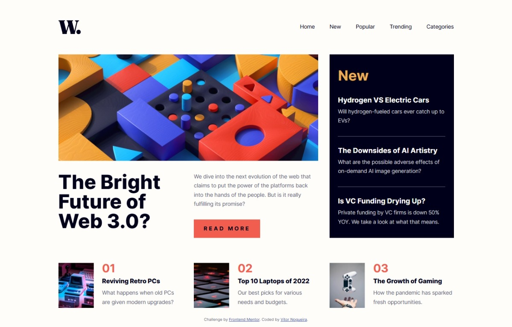

# Frontend Mentor - News homepage solution

This is a solution to the [News homepage challenge on Frontend Mentor](https://www.frontendmentor.io/challenges/news-homepage-H6SWTa1MFl). Frontend Mentor challenges help you improve your coding skills by building realistic projects. 

## Table of contents

- [Overview](#overview)
  - [The challenge](#the-challenge)
  - [Screenshot](#screenshot)
  - [Links](#links)
- [My process](#my-process)
  - [Built with](#built-with)
  - [What I learned](#what-i-learned)
  - [AI Collaboration](#ai-collaboration)
- [Author](#author)

## Overview

### The challenge

Users should be able to:

- View the optimal layout for the interface depending on their device's screen size
- See hover and focus states for all interactive elements on the page

### Screenshot

### Links

- Solution URL: [https://github.com/VitorEmanoelNogueira/news-homepage-main](https://github.com/VitorEmanoelNogueira/news-homepage-main)
- Live Site URL: [https://vitoremanoelnogueira.github.io/news-homepage-main/](https://vitoremanoelnogueira.github.io/news-homepage-main/)

## My process

### Built with

- Semantic HTML5 markup;
- BEM, namespaces and SMACSS;
- CSS custom properties;
- Flexbox;
- CSS Grid;
- Mobile-first workflow.

### What I learned

- Skiplink implementation;
- Drawer Menu Implementation;
- The use of intermediate states, e.g. `is-closing`;
- The use of the `inert` attribute;
- How to implement a manual focus-trap;
- How to use `@media (hover:hover) and (pointer:fine)` to ensure hover states  are only applied on devices that support them, avoiding sticky hover styles on mobile devices;
- How to use `matchMedia` in JS;
- How to the `transitionend` event;
- How to better handle svg for `forced-colors` mode;
- The contribution of `viewBox` for SVG scalling.

### AI Collaboration

I used ChatGPT to help me think through, structure, and debug parts of the project. It was especially helpful while investigating screen reader issues and considering ways to improve the experience for users who rely on assistive technologies.

Some of its suggestions worked very well, while others were clearly unsuitable for the context. This reinforces that AI can be a valuable tool for exploring and troubleshooting, but it still requires someone with the knowledge and experience to evaluate its suggestions, understand the underlying issues, and make the final decisions.

## Author

- Frontend Mentor - [@VitorEmanoelNogueira](https://www.frontendmentor.io/profile/VitorEmanoelNogueira)